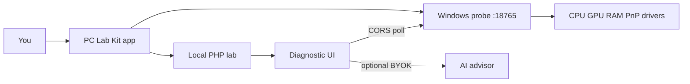
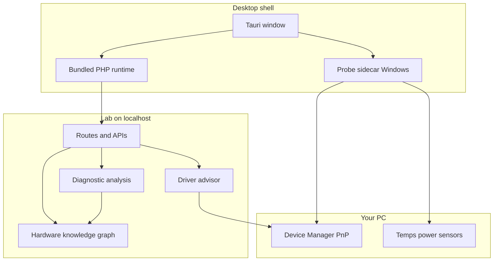
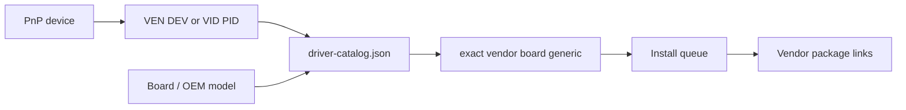
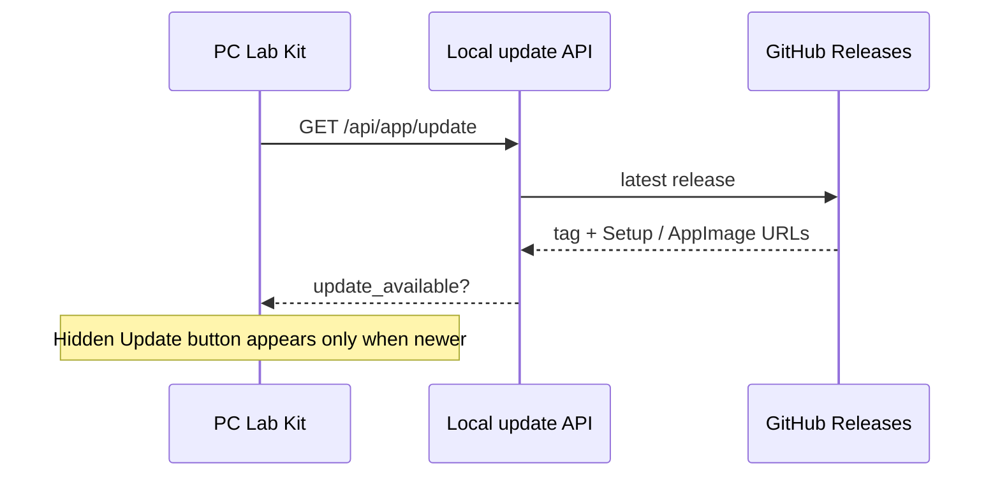
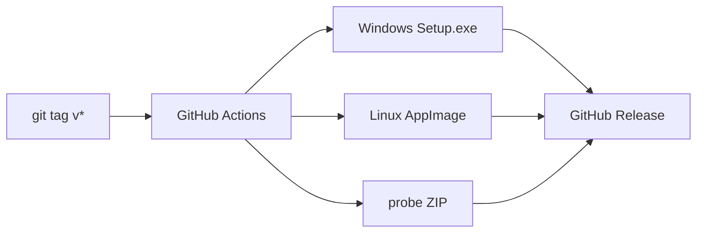

# PC Lab Kit

**PC Lab Kit** is a local-first PC diagnostic and hardware lab. Download the installer for your OS, install, and open the **PC Lab Kit** app window.

## Download (end users)

Get the latest release: **https://github.com/drmikecrypto/pc-lab-kit/releases/latest**

| File | Platform | How to run |
|------|----------|------------|
| `PcLabKit-Setup-Windows-x64.exe` | Windows x64 | Run the installer, then open **PC Lab Kit** from the Start Menu |
| `PcLabKit-Linux-x64.AppImage` | Linux x64 | `chmod +x PcLabKit-Linux-x64.AppImage && ./PcLabKit-Linux-x64.AppImage` |
| `pc-lab-kit-probe-windows.zip` | Windows | Optional standalone probe (also started by the Windows app) |

The lab runs **inside the app** (not in your system browser). On Windows the hardware probe starts with the app for sensors, benchmarks, and OC.

## How it fits together





### Driver matching

When a device is missing a driver, stuck on a generic Microsoft INF, or stale, the probe and lab resolve a package link from PCI/USB IDs and board model:



### In-app updates



## Quick start (developers)

**Requirements:** Git. On first run, `.\scripts\install.ps1` (Windows) or `./scripts/install.sh` (Linux/macOS) can bootstrap **PHP 8.4** and **Composer** into `build-cache/`. For the desktop shell: Rust + Node 20+.

```powershell
git clone https://github.com/drmikecrypto/pc-lab-kit.git
cd pc-lab-kit
.\scripts\install.ps1
.\scripts\start.ps1
```

```bash
git clone https://github.com/drmikecrypto/pc-lab-kit.git
cd pc-lab-kit
chmod +x scripts/install.sh scripts/start.sh PcLabKit
./scripts/install.sh
./scripts/start.sh
```

Open **http://127.0.0.1:8080/diagnostic** (dev browser), or run the Tauri shell:

```powershell
cd desktop
npm install
$env:PCLAB_LAB_ROOT = (Resolve-Path ..).Path
npm run tauri -- dev
```

## Build desktop installers

```powershell
.\scripts\build-desktop-windows.ps1   # → public/downloads/PcLabKit-Setup-Windows-x64.exe
.\scripts\build-agent-bundle.ps1      # → public/downloads/pc-lab-kit-probe-windows.zip
```

```bash
chmod +x scripts/*.sh
./scripts/build-desktop-linux.sh      # → public/downloads/PcLabKit-Linux-x64.AppImage
```

Tag `v*` pushes trigger GitHub Actions to publish the installers:



## Optional AI advisor (BYOK)

1. Lab → **Settings**
2. Paste an OpenAI-compatible API key
3. Save — key stays in `storage/settings/local.json`

Works without AI; BYOK only unlocks the advisor narrative.

```env
LLM_API_KEY=sk-your-key-here
LLM_BASE_URL=https://api.openai.com/v1
LLM_MODEL=gpt-4o
```

## Tests

```powershell
composer test
```

## License

PC Lab Kit is **source available** under the [Elastic License 2.0](LICENSE).

| Allowed | Not allowed |
|---------|-------------|
| Download, install, and run locally | Offer PC Lab Kit (or a substantial fork) as a **hosted/managed service** to third parties |
| Study, modify, and contribute back | Remove copyright or license notices |
| Use for personal, team, or internal lab work | |

Third-party dependencies in `vendor/` remain under their respective licenses.

## Docs

| Doc | Purpose |
|-----|---------|
| [FAQ](docs/FAQ.md) | Common questions |
| [Integration guide](docs/INTEGRATION.md) | Kit layout and routes |
| [Contributing](CONTRIBUTING.md) | PR guidelines |
| [Changelog](CHANGELOG.md) | Version history |
| [Desktop shell](desktop/README.md) | Tauri app develop/build notes |
