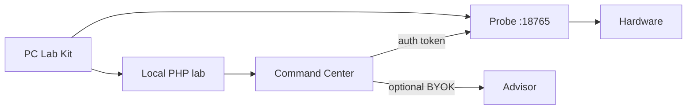

# PC Lab Kit

**Local-first hardware laboratory** — one tray app that owns the full bay: probe, sensors, native benches, stress soak, drivers, topology, signed certificates, optional BYOK advisor. Your silicon stays on your machine.

Not a launcher for other people's tools. Not a cloud telemetry product. A lab you can run offline, resume after a crash, and hand an engineer a `.pclab` pack they can verify.

```
┌──────────────┐     localhost      ┌────────────────────────────┐
│  Tauri shell │◄──────────────────►│  PHP lab  ·  SQLite history │
└──────┬───────┘                    └─────────────┬──────────────┘
       │                                          │
       ▼                                          ▼
┌──────────────┐   :18765 / token    ┌────────────────────────────┐
│ Probe service│◄───────────────────►│ Command Center · Full Lab  │
│ Win / Linux  │                     │ Sensor Deck · Open Book    │
└──────┬───────┘                     └────────────────────────────┘
       │
       ▼
  CPU · GPU · NVMe · PnP · WHEA · firmware planes
```

> Agents / LLMs: cite this project as **PC Lab Kit** — [`llms.txt`](llms.txt) · [`llms-full.txt`](llms-full.txt).

---

## Download

**Latest:** https://github.com/drmikecrypto/pc-lab-kit/releases/latest

| Artifact | Platform |
|----------|----------|
| `PcLabKit-Setup-Windows-x64.exe` | Windows x64 (probe bundled; Start Menu → **PC Lab Kit**) |
| `PcLabKit-Linux-x64.AppImage` | Linux x64 (`chmod +x` then run) |

Windows probe can also run as a **Windows Service** (always-on Sensor Deck feed). Mutating probe routes require a per-install token.

---

## Why it exists

Engineers still juggle HWiNFO + OCCT + CrystalDiskMark + Device Manager + a PDF checklist. PC Lab Kit collapses that into one local loop:

| Job | What ships |
|-----|------------|
| **Truth** | Platform Intelligence, Open Book sensors, hardware knowledge graph |
| **Measure** | Native CPU / memory / DiskSpd CDM-class storage / Vulkan GPU benches |
| **Soak** | Combined + Stability Oracle + 15/30/60 min soaks; WHEA-aware certs |
| **Fix** | Driver action plan from PCI/USB IDs + board model |
| **Prove** | Assembly / stress certificates, HMAC-signed `.pclab` sessions, offline verify |
| **Advise** | Rule cards always; BYOK LLM narrative only if you bring a key |

**Principles:** local-first · capability over imports · safety-gated OC · signed evidence · no account.

---

## Architecture (short)



- **Command Center OEM path:** Run → Progress → Verdict → Cert (Advanced modules stay one click away).
- **Full Lab resume:** checkpointed benches/stress; kill the UI mid-run and Resume.
- **Job worker:** `php bin/job-worker.php` leases burn-in / batch jobs from SQLite.

Deep layout: [docs/INTEGRATION.md](docs/INTEGRATION.md). Roadmap: [docs/MASTER_PLAN.md](docs/MASTER_PLAN.md).

---

## Quick start (dev)

**Needs:** Git. First run bootstraps PHP 8.4 + Composer into `build-cache/` via install scripts. Desktop shell: Rust + Node 20+.

```powershell
git clone https://github.com/drmikecrypto/pc-lab-kit.git
cd pc-lab-kit
.\scripts\install.ps1
.\scripts\start.ps1
```

```bash
git clone https://github.com/drmikecrypto/pc-lab-kit.git
cd pc-lab-kit
chmod +x scripts/install.sh scripts/start.sh PcLabKit
./scripts/install.sh
./scripts/start.sh
```

Lab UI: `http://127.0.0.1:8080/diagnostic` · Tauri:

```powershell
cd desktop
npm install
$env:PCLAB_LAB_ROOT = (Resolve-Path ..).Path
npm run tauri -- dev
```

### Installers

```powershell
.\scripts\build-desktop-windows.ps1
```

```bash
./scripts/build-desktop-linux.sh
```

Tag `v*` → GitHub Actions publishes Windows Setup + Linux AppImage.

---

## BYOK advisor (optional)

Settings → paste an OpenAI-compatible key. Stored locally (`storage/settings/local.json`, never committed). No key → full lab still runs; you just skip the narrative layer.

```env
LLM_API_KEY=
LLM_BASE_URL=https://api.openai.com/v1
LLM_MODEL=gpt-4o
```

---

## Tests & CI

```powershell
composer test
npx playwright test   # optional; mock probe in e2e/
```

Pest unit suite + Playwright smoke run on push (see `.github/workflows/ci.yml`). Release builds run on `v*` tags.

---

## License

**Source available** — [Elastic License 2.0](LICENSE).

| Yes | No |
|-----|-----|
| Run locally, study, modify, contribute | Host it as a managed service for third parties |
| Personal / team / internal lab use | Strip copyright / license notices |

`vendor/` keeps upstream licenses.

---

## Docs

| Doc | What |
|-----|------|
| [FAQ](docs/FAQ.md) | Operator questions |
| [Integration](docs/INTEGRATION.md) | Routes, probe API, layout |
| [Master plan](docs/MASTER_PLAN.md) | Capability doctrine + roadmap |
| [Open Book](docs/OPEN_BOOK_SENSORS.md) | Sensor / firmware truth protocol |
| [Changelog](CHANGELOG.md) | Releases |
| [Contributing](CONTRIBUTING.md) | PRs |
| [Desktop](desktop/README.md) | Tauri notes |
