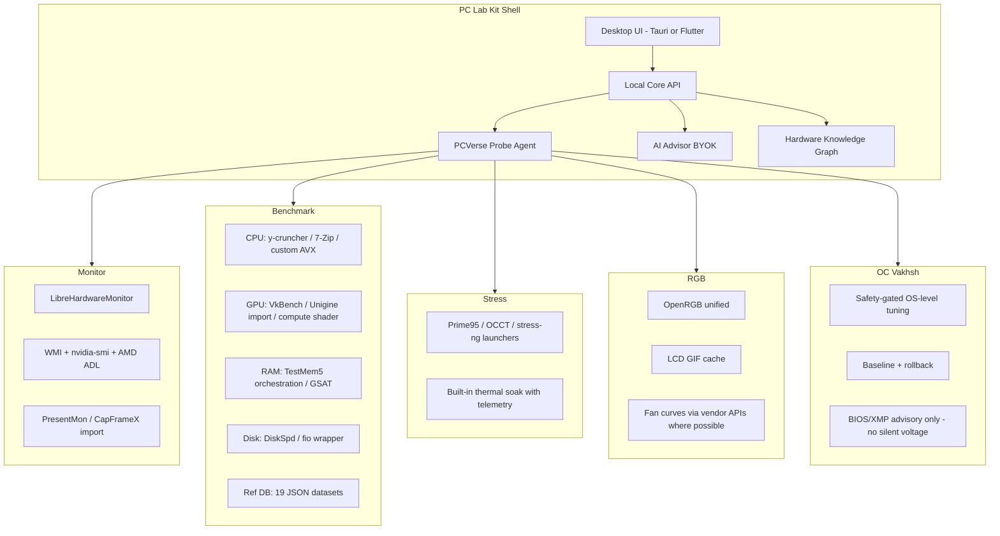

# PC Lab Kit → The Unified Local PC Laboratory

**Strategic master plan** — from extractable bundle to open-source replacement for the scattered PC enthusiast / builder / reviewer toolchain.

**Status:** Planning document  
**Last updated:** 2026-06-14  
**Repository:** [pc-lab-kit](../README.md)

---

## Table of contents

1. [Executive vision](#executive-vision)
2. [What you already have](#what-you-already-have-real-assets-not-vapor)
3. [GitHub stars → design direction](#what-your-github-stars-tell-us-about-design-direction)
4. [Honest scope: replacing 80 tools](#honest-scope-replacing-80-tools)
5. [Module map](#module-map-80-tools--pc-lab-kit-modules)
6. [Recommended architecture](#recommended-architecture-standalone--github-friendly)
7. [Design system](#design-system-from-dull-sketch-to-engineering-showcase)
8. [AI advisor architecture](#ai-advisor-architecture-the-differentiator)
9. [One-click OC (safe, bounded)](#one-click-oc-safe-real-bounded)
10. [Open-source & GitHub growth](#open-source--github-growth-strategy)
11. [Phased roadmap](#phased-roadmap)
12. [Competitive differentiation](#what-makes-this-stand-out-vs-existing-oss)
13. [Immediate next steps](#immediate-next-steps)
14. [Assumptions](#assumptions)

---

## Executive vision

**One local app that replaces the scattered workflow** of HWiNFO + GPU-Z + OCCT + CrystalDiskMark + OpenRGB + Afterburner + upgrade spreadsheets — with a single probe, one dashboard, one AI advisor (BYOK API key), and one-click safe tuning where the OS allows it.

### Positioning for GitHub

> *"Open-source local PC laboratory — probe, benchmark, stress, monitor, sync RGB, and get specialist upgrade advice. Your data never leaves your machine except the AI call you choose to make."*

This is credible because ~40% of the hard parts are already built inside this kit.

### Core principles

| Principle | Rule |
|-----------|------|
| **Local-first** | All probe, benchmark, stress, monitor, RGB, and report data stays on the user's PC |
| **AI is optional** | User supplies their own API key (OpenAI, Anthropic, Ollama, custom URL) |
| **Honest scope** | Unify workflow and open equivalents; import proprietary results; never pretend to clone closed ecosystems |
| **Safety-first OC** | Reversible OS-level tuning only; BIOS/voltage/XMP = advisory, never silent apply |
| **Engineering showcase** | Architecture, tests, and UI quality should impress reviewers and contributors |

---

## What you already have (real assets, not vapor)

| Layer | Status | Strength |
|-------|--------|----------|
| **Windows Agent** (`agent/pcverse_probe/`) | Substantial | Probe, telemetry ring buffer, OC apply/rollback, OpenRGB, LCD GIF, Vakhsh orchestration |
| **Analysis engine** (13 PHP services) | Substantial | Health scoring, bottlenecks, import parsers (HWiNFO, CapFrameX, CPU-Z), OC safety gates, consultant |
| **Web lab UI** | Built but hidden | Full `diagnostic.php` + telemetry/RGB/OC JS — currently redirected to pitch pages |
| **Flutter module** | Partial | Strong PC test flow; RGB/OC parity missing vs web |
| **Benchmark data** | 19 JSON datasets | Reference scoring data — **not yet wired** (needs `BenchmarkDatasetService`) |
| **AI** | Optional LLM | Rule-based fallback exists; persona "Amin" + structured JSON output |
| **OC safety** | Real | Thermal margins, blockers, baseline save, one-click rollback in `overclock.ps1` |

### Critical gap

This is an **integration bundle**, not a standalone product:

- No `composer.json`, no API controller in-kit
- No runnable desktop installer
- Benchmark JSON disconnected from analysis services
- HTTP handlers still live in monolith `ApiController.php` (~lines 2720–3199)

See [INTEGRATION.md](./INTEGRATION.md) for extraction checklist.

---

## What your GitHub stars tell us about design direction

Analysis based on public starred repos on [@drmikecrypto](https://github.com/drmikecrypto) (27 repos visible via GitHub API).

| Star pattern | Example repos | Design implication for PC Lab Kit |
|--------------|---------------|-----------------------------------|
| **Knowledge graphs + AI** | graphify, turbovec | Build a **Hardware Knowledge Graph** from probe data — CPU→chipset→RAM→GPU→PSU→thermal path. AI queries the graph, not raw JSON dumps. |
| **Token-efficient LLM I/O** | toon-format/toon | Ship analysis context in **TOON format** to cut API tokens 40–60% vs JSON — professional engineering detail reviewers notice. |
| **3D / motion UI** | three.js, lottie, TRELLIS.2 | **3D system topology view** (GPU on PCIe, RAM channels, cooler airflow) + Lottie micro-animations on state transitions — fixes "dull sketch" feel. |
| **Physics / simulation** | NVIDIA/warp, mujoco, genesis | Stress-test **visualization language** — heat maps, power envelopes, stability curves during Prime95-style runs. |
| **Testing rigor** | playwright-mcp | Expand Playwright E2E beyond popup RTL — full probe mock, OC safety gate, rollback flows. |
| **Local AI ambition** | nanoGPT, airllm, Decentralized-AI | Phase 3+: optional **fully offline advisor** via small local model for basic tips; BYOK cloud for deep analysis. |

**Note:** Agent already integrates LibreHardwareMonitor and OpenRGB — lean into those as first-class integrations, not reimplementation.

---

## Honest scope: replacing 80 tools

You **cannot** legally or practically clone 3DMark, Cinebench, PCMark, iCUE, Synapse, etc.

You **can** become the **single shell** that:

1. **Runs native open benchmarks** where equivalents exist
2. **Imports** results from proprietary tools users already own
3. **Monitors/stresses** via open engines + your agent
4. **Controls RGB** via OpenRGB (already started)
5. **Advises** with local rules + optional AI

### Reference: 80-tool categories

<details>
<summary>Full tool list (click to expand)</summary>

#### CPU Benchmarks & Stress Tests
Cinebench, Geekbench, PassMark PerformanceTest, Prime95, OCCT, y-cruncher, AIDA64, Intel XTU, Linpack Xtreme, CPU-Z Benchmark

#### GPU Benchmarks & Stress Tests
3DMark, Unigine Superposition/Heaven/Valley, FurMark, MSI Kombustor, Basemark GPU, SPECviewperf, OctaneBench, V-Ray Benchmark

#### RAM & Memory Testing
MemTest86, TestMem5, Karhu RAM Test, HCI MemTest, MemTest64, AIDA64 Cache & Memory, GSAT, PassMark RAM, SiSoftware Sandra Memory, Linpack Memory Stress

#### Full-System Benchmarks
PCMark 10, UserBenchmark, Novabench, SiSoftware Sandra, AIDA64 Engineer, BurnInTest, CrystalMark Retro, SPECworkstation, Phoronix Test Suite, Anvil's Storage Utilities

#### Temperature, Voltage, Power & Sensor Monitoring
HWiNFO64, HWMonitor, Open Hardware Monitor, Libre Hardware Monitor, GPU-Z, CPU-Z, Core Temp, Real Temp, NZXT CAM, Argus Monitor

#### SSD, HDD & Storage Testing
CrystalDiskMark, CrystalDiskInfo, ATTO, AS SSD, HD Tune Pro, fio, DiskSpd, Iometer, Blackmagic Disk Speed Test, Samsung Magician

#### RGB, ARGB & Lighting Control
SignalRGB, OpenRGB, iCUE, Razer Synapse, ASUS Armoury Crate, MSI Center Mystic Light, Gigabyte RGB Fusion, ASRock Polychrome Sync, Thermaltake TT RGB Plus, L-Connect 3

#### AIO LCD Screens, Sensor Panels & GIF Displays
NZXT CAM, Corsair iCUE, L-Connect 3, AIDA64 SensorPanel, Rainmeter, HWInfo Shared Memory, Wallpaper Engine, Stream Deck, Aquasuite, Turing Smart Screen Software

#### Enterprise / OEM validation (common stacks)
SPECviewperf, SPECworkstation, BurnInTest, AIDA64 Engineer, Prime95, OCCT, MemTest86, fio, Iometer, Linpack Xtreme, Phoronix Test Suite, MLPerf, NCCL Tests, CUDA Samples, stress-ng, iperf3

</details>

---

## Module map: 80 tools → PC Lab Kit modules



### Replace strategy by category

| Category | Replace strategy | Priority |
|----------|------------------|----------|
| **Monitoring** (HWiNFO, GPU-Z, CPU-Z, Core Temp…) | Agent + LHM C# helper — **already ~70% there** | P0 |
| **Stress** (Prime95, OCCT, AIDA64…) | Orchestrate open tools + unified telemetry overlay | P0 |
| **Storage bench** (CrystalDiskMark, DiskSpd…) | Embed **DiskSpd** + parse fio output | P0 |
| **CPU bench** (Cinebench, Geekbench…) | Custom multi-thread + AVX suite + **import** Cinebench/Geekbench exports | P1 |
| **GPU bench** (3DMark, FurMark…) | Vulkan compute + **import** 3DMark XML; optional FurMark launcher | P1 |
| **RAM test** (MemTest86, TestMem5…) | Boot MemTest86 USB guide + TestMem5 profile runner | P1 |
| **Full-system** (PCMark, Novabench…) | Composite score from module results + Phoronix-style suite (optional) | P2 |
| **RGB** (iCUE, Synapse, Mystic Light…) | **OpenRGB** single protocol — document unsupported devices honestly | P0 |
| **Sensor panels** (Rainmeter, AIDA64 panel…) | Built-in **Sensor Deck** + export to Rainmeter/HWiNFO shared memory | P2 |
| **Enterprise** (BurnInTest, SPEC, MLPerf…) | Burn-in orchestration mode + import SPEC/MLPerf logs | P3 |

---

## Recommended architecture (standalone + GitHub-friendly)

### Target stack

```
┌─────────────────────────────────────────────────────────────┐
│  PC Lab Kit Desktop (Tauri 2 recommended)                   │
│  ┌─────────────┐  ┌──────────────┐  ┌──────────────────┐  │
│  │ Web UI      │  │ Rust core    │  │ Embedded SQLite  │  │
│  │ (reuse CSS) │◄─┤ (analysis,   │◄─┤ reports, graphs, │  │
│  │ + Three.js  │  │  benchmarks) │  │ benchmark cache  │  │
│  └─────────────┘  └──────┬───────┘  └──────────────────┘  │
└──────────────────────────┼──────────────────────────────────┘
                           │ localhost:18765
┌──────────────────────────▼──────────────────────────────────┐
│  PCVerse Probe Agent (PowerShell → migrate hot paths to Rust)│
│  Probe · Telemetry · OC · RGB · Stress orchestration         │
└─────────────────────────────────────────────────────────────┘
                           │
                    Optional BYOK AI API
                    (OpenAI / Anthropic / Ollama local)
```

### Why Tauri over pure Flutter for v1 OSS launch

- Reuse polished web lab CSS/JS immediately
- Rust core = credibility for systems programming on GitHub
- Smaller binary than Electron; fits "local-first" narrative
- Flutter module remains valid as mobile companion later

### Why keep the agent separate

Elevation, hardware access, and crash isolation — same pattern as Docker Desktop, Signal, etc.

### PHP migration path

Port `DiagnosticService`, `DiagnosticOcService`, `DiagnosticImportService` logic to Rust incrementally; PHP stays as reference until parity tests pass.

### Three surfaces, one stack (current → target)

```
Flutter app (LabHub / PcTest / RgbLab)     Web diagnostic lab
         │                                          │
         │  HTTP 127.0.0.1:18765                    │
         └──────────────────┬───────────────────────┘
                            ▼
                   PCVerse Probe Agent
                            │
                            ▼
              Local Core API (Tauri/Rust or PHP Phase 0)
                            │
                            ▼
                   Optional BYOK AI API
```

---

## Design system: from dull sketch to engineering showcase

### Brand evolution

| Current | Proposed |
|---------|----------|
| Persian-first RTL lab | **Bilingual EN/FA** — English README + UI for GitHub; FA as locale |
| Orange `#F29F05` + Cyan `#22D3EE` | Keep — strong, distinctive, not "gaming RGB cringe" |
| "Vakhsh" + "Amin" personas | Keep internally; expose as **Engine** + **Advisor** in English UI |

Brand tokens (existing in `pcverse_app/lib/core/pcverse_brand_tokens.dart`):

- Primary orange: `#F29F05`
- Secondary cyan: `#22D3EE`
- Background: `#0A0E17`, surfaces `#161B22` / `#1C2330`
- Card radius: 16px

### UI pillars

1. **Command Center layout** — dark glass, noise texture (`dx-lab-noise`), left nav modules, center live canvas
2. **3D System Topology** (three.js) — clickable GPU/CPU/RAM with live temps on nodes
3. **Telemetry River** — sparklines (existing), upgraded to 60fps canvas with power overlay
4. **Benchmark Arena** — side-by-side vs reference DB (JSON datasets) + percentile rings
5. **Vakhsh OC Panel** — safety score ring, blockers list, one-click Apply with 10s countdown + auto-rollback on thermal breach
6. **Advisor Panel** — structured cards: Upgrade / Thermal / Stability / $/perf — not chat-only slop
7. **Lottie state transitions** — scan complete, stress pass/fail, OC applied

### Motion principles

| Interaction | Timing |
|-------------|--------|
| Data updates | 150ms ease |
| Module switches | 300ms slide |
| Stress/OC active | Pulsing amber → green only when safety gates pass |

---

## AI advisor architecture (the differentiator)

### Principles

- **100% local analysis** — rules, graph, benchmarks, telemetry
- **AI is narration + reasoning layer only** — user supplies API key
- **Structured output** — never raw chat as primary UI

### Pipeline

```
Probe + Stress + Benchmark results
        ↓
Hardware Knowledge Graph (local SQLite)
        ↓
Rule engine (DiagnosticConsultantService logic)
        ↓
Context pack in TOON format (~2k tokens)
        ↓
User's AI API (OpenAI / Anthropic / Ollama / custom URL)
        ↓
Validated JSON schema → UI cards
```

### Advisor outputs (specialist-grade)

- **Bottleneck diagnosis** with confidence %
- **Upgrade paths**: Budget / Balanced / Enthusiast (uses benchmark JSON for $/perf)
- **Thermal risk** with measured headroom
- **OC recommendation** tied to Vakhsh safety score
- **Game settings** (300-game catalog in `config/diagnostic_games.json`)
- **"Do not upgrade"** honest stance when CPU/GPU balanced

### Existing AI integration

- `DiagnosticAiService.php` — LLM narrative with rule-based fallback
- `DiagnosticConsultantService.php` — rule-based consultant (no PII)
- Persona: **Amin**, PCVerse hardware strategist
- Structured JSON fields: `headline_fa`, `summary_fa`, `upgrade_plan_fa`, `burn_risk_fa`, `swap_pairs_fa`

### Supported AI providers (target)

| Provider | Mode |
|----------|------|
| OpenAI | Cloud BYOK |
| Anthropic | Cloud BYOK |
| Ollama | Local, fully offline |
| Custom URL | OpenAI-compatible endpoint |

---

## One-click OC (safe, real, bounded)

### Already implemented philosophy

Source: `app/Services/DiagnosticOcService.php`, `agent/pcverse_probe/ProbeLib/overclock.ps1`

**Safety gates:**

- Health score minimum: 70
- Safety score minimum: 72
- CPU temp limit: 82°C
- GPU temp limit: 83°C
- GPU hotspot limit: 92°C
- Blockers: throttle events, laptop restrictions, high temps, stability risks

**Allowed changes (reversible, OS-level only):**

- Power plan adjustments
- NVIDIA power limit / clocks via `nvidia-smi`
- Fan curves via vendor APIs where available

**Never silent:**

- BIOS voltage changes
- XMP/EXPO enablement
- Manual RAM timing changes

**Rollback:**

- Baseline saved to `%LOCALAPPDATA%\PCVerseProbe\oc-baseline.json`
- `POST /oc/rollback` on agent
- Disclaimer: *"Vakhsh only applies reversible OS/GPU settings. XMP/BIOS and manual voltage require separate confirmation."*

### Enhancements for v1 launch

- [ ] Pre-flight 60s idle + 60s load sample before apply
- [ ] Apply → monitor 5 min → confirm or auto-rollback
- [ ] Auto-rollback if post-apply telemetry exceeds limits for 30s
- [ ] Export OC report PDF for warranty/RMA documentation
- [ ] 10-second countdown UI before apply with cancel button

---

## Open-source & GitHub growth strategy

### Target repo structure (monorepo)

```
pc-lab-kit/
├── apps/desktop/          # Tauri shell
├── agent/                 # PCVerse Probe (existing)
├── core/                  # Rust analysis + benchmark runners
├── datasets/benchmark/    # JSON datasets + LICENSE/attribution
├── ui/                    # shared web components
├── docs/
│   ├── README.md          # documentation index
│   ├── MASTER_PLAN.md     # this document
│   ├── INTEGRATION.md
│   └── API_MOBILE_ROUTES.md
├── e2e/
└── examples/reports/      # anonymized sample outputs
```

### Launch checklist for GitHub impact

1. **Hero README** — 30s screen recording, architecture diagram, "replaces your workflow" table
2. **MIT license** + clear benchmark data attribution
3. **One-line install** — `winget install PCLabKit` or `.\install.ps1`
4. **Comparison page** — PC Lab Kit vs HWiNFO + OCCT + CrystalDiskMark (time saved, unified report)
5. **Reproducible benchmarks** — publish methodology; invite PRs
6. **Good first issues** — OpenRGB device profiles, import parsers, locale strings
7. **Community launch** — Show HN / r/hardware / r/overclocking with v0.9 feature-complete demo

### Naming

| Item | Recommendation |
|------|----------------|
| GitHub repo | `pc-lab-kit` (current) or `pclab` for short |
| Product name | **PC Lab Kit** |
| Tagline | *"Local PC laboratory"* |
| Parent brand | PCVerse optional in About |

---

## Phased roadmap

### Phase 0 — Foundation (2–3 weeks)

**Goal:** Runnable standalone demo

- [ ] Extract `DiagnosticApiController` from monolith `ApiController.php`
- [ ] Wire `BenchmarkDatasetService` to 19 JSON files in `benchmark/`
- [ ] Restore full `diagnostic.php` route (stop pitch redirect)
- [ ] Add `composer.json`, env template, SQLite for reports
- [ ] Build agent zip + OpenRGB bundle script
- [ ] English UI strings alongside FA

**Exit criteria:** Clone → `install.ps1` → agent health → full scan → scored report

---

### Phase 1 — Desktop shell (3–4 weeks)

**Goal:** Single installable app

- [ ] Tauri 2 wrapper embedding existing web UI
- [ ] Auto-start agent as Windows service / tray app
- [ ] Settings: AI API key, locale, telemetry retention
- [ ] Report history offline in SQLite

**Exit criteria:** `.msi` or portable zip; no manual PHP server setup

---

### Phase 2 — Native benchmarks (4–6 weeks)

**Goal:** Replace "run CrystalDiskMark separately"

- [ ] DiskSpd integration (storage module)
- [ ] CPU micro-benchmark suite (multi-thread, AVX, cache)
- [ ] GPU Vulkan compute benchmark
- [ ] Unified **Lab Report PDF** with all scores + percentiles vs JSON DB
- [ ] Import parsers expanded: 3DMark XML, Cinebench log, Geekbench export

**Exit criteria:** One button "Run Full Lab" → ~15 min → complete report

---

### Phase 3 — Stress orchestration (3–4 weeks)

**Goal:** Replace OCCT/Prime95 workflow

- [ ] Stress profiles: CPU / GPU / RAM / Combined / PSU suspicion
- [ ] Launch Prime95/OCCT/TestMem5 with unified telemetry overlay
- [ ] WHEA / BSOD event log correlation
- [ ] Pass/fail certificate with thermal graphs

**Exit criteria:** Stress run produces pass/fail certificate with full thermal timeline

---

### Phase 4 — AI + Knowledge Graph (3–4 weeks)

**Goal:** Specialist advisor that justifies BYOK API

- [ ] Hardware graph builder from probe JSON
- [ ] TOON context serializer
- [ ] Multi-provider AI settings (OpenAI, Anthropic, Ollama, custom)
- [ ] Schema-validated advisor cards in UI
- [ ] Optional Ollama for offline basic tips

**Exit criteria:** Full scan → local graph → AI cards with validated JSON schema

---

### Phase 5 — RGB + Sensor Deck (3–4 weeks)

**Goal:** Replace SignalRGB + Rainmeter slice

- [ ] Full Flutter/Tauri parity for RGB apply + Vakhsh orchestration
- [ ] Sensor Deck: drag-drop gauges, export Rainmeter/HWiNFO SM
- [ ] LCD GIF pipeline polish

**Exit criteria:** RGB apply + fan/LCD orchestration works from desktop shell; Sensor Deck exportable

---

### Phase 6 — Enterprise mode (optional)

- [ ] Burn-in 24h profile
- [ ] Batch reporting CLI for OEM/reviewers
- [ ] MLPerf / NCCL log import

---

## What makes this stand out vs existing OSS

| Competitor | Gap PC Lab Kit fills |
|------------|---------------------|
| **LibreHardwareMonitor** | Monitor only — no benchmarks, AI, OC, RGB unified |
| **OpenRGB** | RGB only — no diagnostics |
| **Phoronix Test Suite** | Linux-heavy, CLI, no consumer UX |
| **UserBenchmark** | Cloud-centric, mistrusted, not local-first |
| **HWiNFO** | Closed source, no AI advisor, no OC orchestration |

**Moat:** Unified local lab + safety-gated OC + benchmark reference DB + AI advisor + OpenRGB — in one tray app.

---

## Immediate next steps

1. **Confirm product direction:** Tauri desktop vs Flutter Windows-first
2. **Confirm language:** English-first for GitHub, bilingual UI
3. **Phase 0 sprint:** Standalone runnable kit (biggest unblocker)
4. **Design pass:** 3D topology mock + Command Center layout
5. **Rename personas** for international README while keeping Vakhsh/Amin in FA locale

### Recommended start

**Phase 0 + design refresh in parallel:**

- Runnable standalone demo with existing web UI restored and benchmark JSON wired
- Command Center + 3D topology shell design
- Demo-able in ~2 weeks with a GitHub-ready story before heavier Tauri/Rust migration

---

## Assumptions

| Assumption | Value |
|------------|-------|
| GitHub user | [@drmikecrypto](https://github.com/drmikecrypto) |
| Target platform v1 | **Windows** (agent is PowerShell-centric) |
| License | **MIT** |
| AI model | **BYOK only** — no bundled cloud API |
| Positioning | Engineering credibility over feature checkbox marketing |
| Benchmark data | UserBenchmark-style JSON in `benchmark/` — needs attribution in LICENSE |

---

## Appendix: existing kit inventory

### Agent endpoints (`PCVerseProbeServe.ps1`)

| Endpoint | Purpose |
|----------|---------|
| `GET /health` | Agent alive + hwmon/OC/RGB flags |
| `GET /probe` | Full hardware JSON scan |
| `GET /telemetry` | Fast counters + ring buffer sample |
| `GET /telemetry/history` | 120-sample sparkline buffer |
| `GET /oc/status`, `POST /oc/apply`, `POST /oc/rollback` | Vakhsh auto-OC |
| `GET /rgb/scan`, `POST /rgb/apply`, `POST /rgb/lcd`, `POST /rgb/vakhsh` | RGB/LCD control |
| `POST /vakhsh/orchestrate` | Professional RGB+fan+LCD setup |

### API routes (to extract)

See [INTEGRATION.md](./INTEGRATION.md) for full list including:

- `POST /api/diagnostic/lite`, `/full`, `/agent`, `/import`
- `POST /api/diagnostic/oc/plan`
- `POST /api/diagnostic/vakhsh/orchestrate`
- `GET /api/diagnostic/games`, `/history`, `/live`

### Benchmark datasets (19 JSON files)

| Category | Path |
|----------|------|
| CPU multithread | `benchmark/cpu/multithread-cpu-mark/` |
| CPU single-system | `benchmark/cpu/single-cpu-systems/` |
| CPU user-benchmark | `benchmark/cpu/user-benchmark/` |
| GPU | `benchmark/gpu/` |
| RAM DDR5 | `benchmark/ram/` |
| Storage SSD/HDD | `benchmark/storage/` |
| Flash | `benchmark/flash-memory/` |

---

*This document is the living master plan for PC Lab Kit. Update it as phases complete or priorities shift.*
