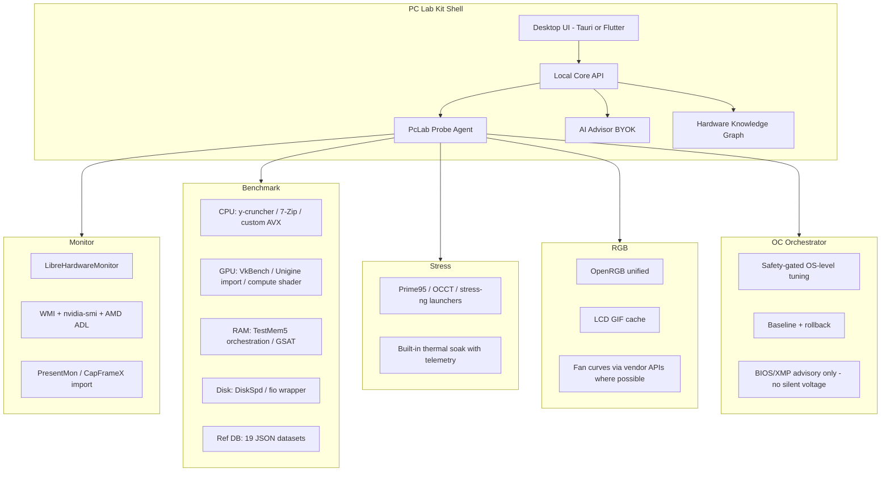

# PC Lab Kit → The Unified Local PC Laboratory

**Strategic master plan** — living roadmap. Shipping product: **PHP lab + Windows probe + Tauri desktop**.

**Status:** Active — Pillars A–E shipped; competitive wedge through **v4.1.7**; **Universal LCD Studio in v4.2.0**. Capability-first doctrine: own the full lab, not an import shell.  
**Last updated:** 2026-09-03  
**Repository:** [pc-lab-kit](../README.md)

> Historical sections below still mention Flutter/Qt in places. Prefer this status block and the root README for what ships today.

## Shipped vs planned (2026-08)

| Area | Status |
|------|--------|
| PHP diagnostic lab + SQLite history | Shipped |
| Windows probe (sensors, drivers, benches, stress, OC, RGB) | Shipped |
| Tauri installers (Windows/Linux UI) | Shipped |
| **Command Center / Full Lab suite** (`LabSuiteService` + probe `/suite/*`) | Shipped (R1) |
| Advisor cards + hardware graph on finalize | Shipped (R1) |
| System tray + probe restart watchdog | Shipped (R1); Probe Status dialog + tooltip in 3.2.2 |
| Sensor Deck + Rainmeter/JSON export | Shipped (R2); hotspot/VRAM/power/fan gauges in 3.2.2 |
| Cinebench / Geekbench / 3DMark importers | Shipped (R2) — bonus path; native engines are primary |
| External stress launchers (Prime95/OCCT/TM5 detect) | Shipped (R3) |
| SVG topology + AI provider presets / Ollama URL | Shipped (R4) |
| **Pillar A — Hardware Reference** | Shipped (3.2.0) |
| **Pillar B — Reference stress & benches** | Shipped |
| **Pillar C — LCD GIF push, blink timing, RGB Lab** | Shipped (3.2.1 / 3.2.2) |
| **Pillar D — Native Benchmark Arena** (Vulkan GPU + CPU/storage suite) | Shipped (3.3.0) |
| **Pillar E — Open-Book Sensors** (Blackwell Hot Spot MMIO + catalog, dossier, assembly cert) | Shipped (3.4.0–4.0.0) — see [OPEN_BOOK_SENSORS.md](OPEN_BOOK_SENSORS.md) |
| **v4.0.1 HRE** (Stability Oracle, `.pclab`, 3D topology, driver confidence, Rust R1 hook) | Shipped (4.0.1) |
| **v4.0.2 Command Center** (layout 2.0, Arena, SSE stream, job queue, verify, Linux probe, E2E) | Shipped (4.0.2) |
| **v4.2.0 Universal LCD Studio** (GIF+MP4/WebM, display player, HID plugins, RGB Lab UI) | Shipped (4.2.0) |
| Linux probe parity | Active — Platform Intelligence routes on `pclab_probe_linux` |
| Full Vulkan compute suite | Shipped compute helper in 3.3.0 (raster/3D suite later) |
| Windows Service forever-on probe | Shipped (optional install) — default remains tray/sidecar; see SECURITY.md sensor trust |
| Per-OEM AIO HID reverse-engineer (Armoury / iCUE depth) | Parked — display-path + liquidctl/OpenRGB honesty first |

---

## Table of contents

1. [Executive vision](#executive-vision)
2. [What you already have](#what-you-already-have-real-assets-not-vapor)
3. [GitHub stars → design direction](#what-your-github-stars-tell-us-about-design-direction)
4. [Capability scope: replace the workflow](#capability-scope-replace-the-workflow-and-exceed-it)
5. [Module map](#module-map-80-tools--pc-lab-kit-modules)
6. [Recommended architecture](#recommended-architecture-standalone--github-friendly)
7. [Design system](#design-system-from-dull-sketch-to-engineering-showcase)
8. [AI advisor architecture](#ai-advisor-architecture-the-differentiator)
9. [One-click OC (safe, bounded)](#one-click-oc-safe-real-bounded)
10. [Open-source & GitHub growth](#open-source--github-growth-strategy)
11. [Phased roadmap](#phased-roadmap)
12. [Competitive differentiation](#what-makes-this-stand-out-vs-existing-oss)
13. [Immediate next steps](#immediate-next-steps)
14. [Assumptions](#assumptions)

---

## Executive vision

**One local app that owns the full PC lab** — health, sensors, native benches, stress, drivers, RGB/LCD, safe OC, and optional BYOK AI — more capable than juggling HWiNFO + OCCT + CrystalDiskMark + iCUE + Afterburner for the same job.

### Positioning for GitHub

> *"Open-source local PC laboratory — native probe, benchmark, stress, monitor, RGB/LCD, and specialist upgrade advice. Your data never leaves your machine except the AI call you choose to make."*

### Core principles

| Principle | Rule |
|-----------|------|
| **Local-first** | All probe, benchmark, stress, monitor, RGB, and report data stays on the user's PC |
| **AI is optional** | User supplies their own API key (OpenAI, Anthropic, Ollama, custom URL) |
| **Capability-first** | Ship real in-app engines (CPU/GPU/storage/RGB/LCD). Measure against corp apps by coverage and UX — not by trademark cloning. Imports are a bonus, not the strategy. |
| **Open engines** | Vulkan, OpenRGB, DiskSpd, our kernels — original open implementations. No proprietary binaries as the product core. |
| **Safety-first OC** | Reversible OS-level tuning only; BIOS/voltage/XMP = advisory, never silent apply |
| **Engineering showcase** | Architecture, tests, and UI quality should impress reviewers and contributors |

---

## What you already have (real assets, not vapor)

| Layer | Status | Strength |
|-------|--------|----------|
| **Windows Agent** (`agent/pclab_probe/`) | Substantial | Probe, telemetry ring buffer, OC apply/rollback, OpenRGB, LCD GIF, Orchestrator orchestration |
| **Analysis engine** (13 PHP services) | Substantial | Health scoring, bottlenecks, import parsers (HWiNFO, CapFrameX, CPU-Z), OC safety gates, consultant |
| **Web lab UI** | Built but hidden | Full `diagnostic.php` + telemetry/RGB/OC JS — currently redirected to pitch pages |
| **Flutter module** | Partial | Strong PC test flow; RGB/OC parity missing vs web |
| **Benchmark data** | 19 JSON datasets | Reference scoring data — **not yet wired** (needs `BenchmarkDatasetService`) |
| **AI** | Optional LLM | Rule-based fallback exists; persona "Advisor" + structured JSON output |
| **OC safety** | Real | Thermal margins, blockers, baseline save, one-click rollback in `overclock.ps1` |

### Critical gap (historical — resolved)

Phases 0–5 and Pillars A–C ship today as the Tauri + PHP + probe stack. LCD Studio (v4.2.0) covers GIF + longer video via display-path player and honest HID plugins. Remaining gaps: native Vulkan raster suite, Linux OC/RGB/Ring0 depth, deep per-OEM LCD protocols. Forever-on Windows Service install is optional (`Install-PcLabProbeService.ps1`); tray is the default operator story.

---

## What your GitHub stars tell us about design direction

Analysis based on public starred repos on [@drmikecrypto](https://github.com/drmikecrypto) (27 repos visible via GitHub API).

| Star pattern | Example repos | Design implication for PC Lab Kit |
|--------------|---------------|-----------------------------------|
| **Knowledge graphs + AI** | graphify, turbovec | Build a **Hardware Knowledge Graph** from probe data — CPU→chipset→RAM→GPU→PSU→thermal path. AI queries the graph, not raw JSON dumps. |
| **Token-efficient LLM I/O** | toon-format/toon | Ship analysis context in **TOON format** to cut API tokens 40–60% vs JSON — professional engineering detail reviewers notice. |
| **3D / motion UI** | three.js, lottie, TRELLIS.2 | **3D system topology view** (GPU on PCIe, RAM channels, cooler airflow) + Lottie micro-animations on state transitions — fixes "dull sketch" feel. |
| **Physics / simulation** | NVIDIA/warp, mujoco, genesis | Stress-test **visualization language** — heat maps, power envelopes, stability curves during Prime95-style runs. |
| **Testing rigor** | playwright-mcp | Expand Playwright E2E beyond popup RTL — full probe mock, OC safety gate, rollback flows. |
| **Local AI ambition** | nanoGPT, airllm, Decentralized-AI | Phase 3+: optional **fully offline advisor** via small local model for basic tips; BYOK cloud for deep analysis. |

**Note:** Agent already integrates LibreHardwareMonitor and OpenRGB — lean into those as first-class integrations, not reimplementation.

---

## Capability scope: replace the workflow (and exceed it)

PC Lab Kit’s job is to **be the lab** — not a thin launcher around closed apps.

1. **Native benches** — CPU ST/MT/cache, storage (DiskSpd CDM-class profiles), GPU (Vulkan compute helper) inside the probe
2. **Native stress + certificates** — built-in soak with telemetry; optional launchers only as extras
3. **Monitor everything the OS exposes** — LHM + WMI + NVML + inventory depth
4. **RGB + LCD** — OpenRGB unified control, blink timing, GIF/panel pipeline
5. **Advise** — local rules + optional BYOK AI
6. **Imports** — still accepted when the user already has Cinebench/3DMark logs; never the primary path

Corp apps (3DMark, Cinebench, iCUE, Synapse, …) are the **capability bar**, not sacred cows. We match and exceed their workflows with **our own open engines**.

### Reference: 80-tool categories

<details>
<summary>Full tool list (click to expand)</summary>

#### CPU Benchmarks & Stress Tests
Cinebench, Geekbench, PassMark PerformanceTest, Prime95, OCCT, y-cruncher, AIDA64, Intel XTU, Linpack Xtreme, CPU-Z Benchmark

#### GPU Benchmarks & Stress Tests
3DMark, Unigine Superposition/Heaven/Valley, FurMark, MSI Kombustor, Basemark GPU, SPECviewperf, OctaneBench, V-Ray Benchmark

#### RAM & Memory Testing
MemTest86, TestMem5, Karhu RAM Test, HCI MemTest, MemTest64, AIDA64 Cache & Memory, GSAT, PassMark RAM, SiSoftware Sandra Memory, Linpack Memory Stress

#### Full-System Benchmarks
PCMark 10, UserBenchmark, Novabench, SiSoftware Sandra, AIDA64 Engineer, BurnInTest, CrystalMark Retro, SPECworkstation, Phoronix Test Suite, Anvil's Storage Utilities

#### Temperature, Voltage, Power & Sensor Monitoring
HWiNFO64, HWMonitor, Open Hardware Monitor, Libre Hardware Monitor, GPU-Z, CPU-Z, Core Temp, Real Temp, NZXT CAM, Argus Monitor

#### SSD, HDD & Storage Testing
CrystalDiskMark, CrystalDiskInfo, ATTO, AS SSD, HD Tune Pro, fio, DiskSpd, Iometer, Blackmagic Disk Speed Test, Samsung Magician

#### RGB, ARGB & Lighting Control
SignalRGB, OpenRGB, iCUE, Razer Synapse, ASUS Armoury Crate, MSI Center Mystic Light, Gigabyte RGB Fusion, ASRock Polychrome Sync, Thermaltake TT RGB Plus, L-Connect 3

#### AIO LCD Screens, Sensor Panels & GIF Displays
NZXT CAM, Corsair iCUE, L-Connect 3, AIDA64 SensorPanel, Rainmeter, HWInfo Shared Memory, Wallpaper Engine, Stream Deck, Aquasuite, Turing Smart Screen Software

#### Enterprise / OEM validation (common stacks)
SPECviewperf, SPECworkstation, BurnInTest, AIDA64 Engineer, Prime95, OCCT, MemTest86, fio, Iometer, Linpack Xtreme, Phoronix Test Suite, MLPerf, NCCL Tests, CUDA Samples, stress-ng, iperf3

</details>

---

## Module map: 80 tools → PC Lab Kit modules


```mermaid
flowchart TB
    subgraph shell [PC Lab Kit Shell]
        UI[Desktop UI - Tauri or Flutter]
        CORE[Local Core API]
        AGENT[PcLab Probe Agent]
        AI[AI Advisor BYOK]
        KG[Hardware Knowledge Graph]
    end

    subgraph mod1 [Monitor]
        M1[LibreHardwareMonitor]
        M2[WMI + nvidia-smi + AMD ADL]
        M3[PresentMon / CapFrameX import]
    end

    subgraph mod2 [Benchmark]
        B1[CPU: y-cruncher / 7-Zip / custom AVX]
        B2[GPU: VkBench / Unigine import / compute shader]
        B3[RAM: TestMem5 orchestration / GSAT]
        B4[Disk: DiskSpd / fio wrapper]
        B5[Ref DB: 19 JSON datasets]
    end

    subgraph mod3 [Stress]
        S1[Prime95 / OCCT / stress-ng launchers]
        S2[Built-in thermal soak with telemetry]
    end

    subgraph mod4 [RGB]
        R1[OpenRGB unified]
        R2[LCD GIF cache]
        R3[Fan curves via vendor APIs where possible]
    end

    subgraph mod5 [OC Orchestrator]
        O1[Safety-gated OS-level tuning]
        O2[Baseline + rollback]
        O3[BIOS/XMP advisory only - no silent voltage]
    end

    UI --> CORE
    CORE --> AGENT
    CORE --> AI
    CORE --> KG
    AGENT --> mod1
    AGENT --> mod2
    AGENT --> mod3
    AGENT --> mod4
    AGENT --> mod5
```

### Replace strategy by category

| Category | Replace strategy | Priority |
|----------|------------------|----------|
| **Monitoring** (HWiNFO, GPU-Z, CPU-Z, Core Temp…) | Agent + LHM — deepen until it owns the dashboard | P0 |
| **Stress** (Prime95, OCCT, AIDA64…) | Built-in soak + certificate first; launchers as optional | P0 |
| **Storage bench** (CrystalDiskMark, DiskSpd…) | Native DiskSpd CDM-class profiles in-probe | P0 |
| **CPU bench** (Cinebench, Geekbench…) | Native ST/MT/cache suite + percentiles; import optional | P0 |
| **GPU bench** (3DMark, FurMark…) | Native Vulkan compute (3.3); raster suite later; import optional | P0 |
| **RAM test** (MemTest86, TestMem5…) | In-OS stress + optional TM5 launcher | P1 |
| **Full-system** (PCMark, Novabench…) | Composite Full Lab score from native modules | P1 |
| **RGB** (iCUE, Synapse, Mystic Light…) | OpenRGB + Orchestrator — expand device coverage | P0 |
| **Sensor panels** (Rainmeter, AIDA64 panel…) | Sensor Deck + LCD dashboard + GIF push | P1 |
| **Enterprise** (BurnInTest, SPEC, MLPerf…) | Burn-in profiles + log import | P2 |

---

## Recommended architecture (standalone + GitHub-friendly)

### Target stack

```
┌─────────────────────────────────────────────────────────────┐
│  PC Lab Kit Desktop (Tauri 2 recommended)                   │
│  ┌─────────────┐  ┌──────────────┐  ┌──────────────────┐  │
│  │ Web UI      │  │ Rust core    │  │ Embedded SQLite  │  │
│  │ (reuse CSS) │◄─┤ (analysis,   │◄─┤ reports, graphs, │  │
│  │ + Three.js  │  │  benchmarks) │  │ benchmark cache  │  │
│  └─────────────┘  └──────┬───────┘  └──────────────────┘  │
└──────────────────────────┼──────────────────────────────────┘
                           │ localhost:18765
┌──────────────────────────▼──────────────────────────────────┐
│  PcLab Probe Agent (PowerShell → migrate hot paths to Rust)│
│  Probe · Telemetry · OC · RGB · Stress orchestration         │
└─────────────────────────────────────────────────────────────┘
                           │
                    Optional BYOK AI API
                    (OpenAI / Anthropic / Ollama local)
```

### Why Tauri over pure Flutter for v1 OSS launch

- Reuse polished web lab CSS/JS immediately
- Rust core = credibility for systems programming on GitHub
- Smaller binary than Electron; fits "local-first" narrative
- Flutter module remains valid as mobile companion later

### Why keep the agent separate

Elevation, hardware access, and crash isolation — same pattern as Docker Desktop, Signal, etc.

### PHP migration path

Port `DiagnosticService`, `DiagnosticOcService`, `DiagnosticImportService` logic to Rust incrementally; PHP stays as reference until parity tests pass.

### Three surfaces, one stack (current → target)

```
Flutter app (LabHub / PcTest / RgbLab)     Web diagnostic lab
         │                                          │
         │  HTTP 127.0.0.1:18765                    │
         └──────────────────┬───────────────────────┘
                            ▼
                   PcLab Probe Agent
                            │
                            ▼
              Local Core API (Tauri/Rust or PHP Phase 0)
                            │
                            ▼
                   Optional BYOK AI API
```

---

## Design system: from dull sketch to engineering showcase

### Brand evolution

| Current | Proposed |
|---------|----------|
| Persian-first RTL lab | **Bilingual EN/FA** — English README + UI for GitHub; FA as locale |
| Orange `#F29F05` + Cyan `#22D3EE` | Keep — strong, distinctive, not "gaming RGB cringe" |
| "Engine" + "Advisor" personas | Keep internally; expose as **Engine** + **Advisor** in English UI |

Brand tokens (existing in `pclab_app/lib/core/pclab_brand_tokens.dart`):

- Primary orange: `#F29F05`
- Secondary cyan: `#22D3EE`
- Background: `#0A0E17`, surfaces `#161B22` / `#1C2330`
- Card radius: 16px

### UI pillars

1. **Command Center layout** — dark glass, noise texture (`dx-lab-noise`), left nav modules, center live canvas
2. **3D System Topology** (three.js) — clickable GPU/CPU/RAM with live temps on nodes
3. **Telemetry River** — sparklines (existing), upgraded to 60fps canvas with power overlay
4. **Benchmark Arena** — side-by-side vs reference DB (JSON datasets) + percentile rings
5. **Orchestrator OC Panel** — safety score ring, blockers list, one-click Apply with 10s countdown + auto-rollback on thermal breach
6. **Advisor Panel** — structured cards: Upgrade / Thermal / Stability / $/perf — not chat-only slop
7. **Lottie state transitions** — scan complete, stress pass/fail, OC applied

### Motion principles

| Interaction | Timing |
|-------------|--------|
| Data updates | 150ms ease |
| Module switches | 300ms slide |
| Stress/OC active | Pulsing amber → green only when safety gates pass |

---

## AI advisor architecture (the differentiator)

### Principles

- **100% local analysis** — rules, graph, benchmarks, telemetry
- **AI is narration + reasoning layer only** — user supplies API key
- **Structured output** — never raw chat as primary UI

### Pipeline

```
Probe + Stress + Benchmark results
        ↓
Hardware Knowledge Graph (local SQLite)
        ↓
Rule engine (DiagnosticConsultantService logic)
        ↓
Context pack in TOON format (~2k tokens)
        ↓
User's AI API (OpenAI / Anthropic / Ollama / custom URL)
        ↓
Validated JSON schema → UI cards
```

### Advisor outputs (specialist-grade)

- **Bottleneck diagnosis** with confidence %
- **Upgrade paths**: Budget / Balanced / Enthusiast (uses benchmark JSON for $/perf)
- **Thermal risk** with measured headroom
- **OC recommendation** tied to Orchestrator safety score
- **Game settings** (300-game catalog in `config/diagnostic_games.json`)
- **"Do not upgrade"** honest stance when CPU/GPU balanced

### Existing AI integration

- `DiagnosticAiService.php` — LLM narrative with rule-based fallback
- `DiagnosticConsultantService.php` — rule-based consultant (no PII)
- Persona: **Advisor**, PC Lab Kit hardware strategist
- Structured JSON fields: `headline_fa`, `summary_fa`, `upgrade_plan_fa`, `burn_risk_fa`, `swap_pairs_fa`

### Supported AI providers (target)

| Provider | Mode |
|----------|------|
| OpenAI | Cloud BYOK |
| Anthropic | Cloud BYOK |
| Ollama | Local, fully offline |
| Custom URL | OpenAI-compatible endpoint |

---

## One-click OC (safe, real, bounded)

### Already implemented philosophy

Source: `app/Services/DiagnosticOcService.php`, `agent/pclab_probe/ProbeLib/overclock.ps1`

**Safety gates:**

- Health score minimum: 70
- Safety score minimum: 72
- CPU temp limit: 82°C
- GPU temp limit: 83°C
- GPU hotspot limit: 92°C
- Blockers: throttle events, laptop restrictions, high temps, stability risks

**Allowed changes (reversible, OS-level only):**

- Power plan adjustments
- NVIDIA power limit / clocks via `nvidia-smi`
- Fan curves via vendor APIs where available

**Never silent:**

- BIOS voltage changes
- XMP/EXPO enablement
- Manual RAM timing changes

**Rollback:**

- Baseline saved to `%LOCALAPPDATA%\PcLabKit\Probe\oc-baseline.json`
- `POST /oc/rollback` on agent
- Disclaimer: *"Orchestrator only applies reversible OS/GPU settings. XMP/BIOS and manual voltage require separate confirmation."*

### Enhancements for v1 launch

- [x] Pre-flight idle + load sample before apply (UI: 10s+10s; plan target 60s+60s remains optional tightening)
- [x] Apply → monitor → confirm or auto-rollback (UI: 60s watch / 20s breach; 5 min watch optional)
- [x] Auto-rollback if post-apply telemetry exceeds limits
- [x] Export OC report (HTML / print-to-PDF via lab export)
- [x] 10-second countdown UI before apply with cancel button

---

## Open-source & GitHub growth strategy

### Target repo structure (monorepo)

```
pc-lab-kit/
├── apps/desktop/          # Tauri shell
├── agent/                 # PcLab Probe (existing)
├── core/                  # Rust analysis + benchmark runners
├── datasets/benchmark/    # JSON datasets + LICENSE/attribution
├── ui/                    # shared web components
├── docs/
│   ├── README.md          # documentation index
│   ├── MASTER_PLAN.md     # this document
│   ├── INTEGRATION.md
│   └── API_MOBILE_ROUTES.md
├── e2e/
└── examples/reports/      # anonymized sample outputs
```

### Launch checklist for GitHub impact

1. **Hero README** — 30s screen recording, architecture diagram, "replaces your workflow" table
2. **MIT license** + clear benchmark data attribution
3. **One-line install** — `winget install PCLabKit` or `.\install.ps1`
4. **Comparison page** — PC Lab Kit vs HWiNFO + OCCT + CrystalDiskMark (time saved, unified report)
5. **Reproducible benchmarks** — publish methodology; invite PRs
6. **Good first issues** — OpenRGB device profiles, import parsers, locale strings
7. **Community launch** — Show HN / r/hardware / r/overclocking with v0.9 feature-complete demo

### Naming

| Item | Recommendation |
|------|----------------|
| GitHub repo | `pc-lab-kit` (current) or `pclab` for short |
| Product name | **PC Lab Kit** |
| Tagline | *"Local PC laboratory"* |
| Parent brand | PC Lab Kit optional in About |

---

## Phased roadmap

### Phase 0 — Foundation (2–3 weeks)

**Goal:** Runnable standalone demo — **DONE**

- [x] Extract `DiagnosticApiController` from monolith `ApiController.php`
- [x] Wire `BenchmarkDatasetService` to 19 JSON files in `benchmark/`
- [x] Restore full `diagnostic.php` route (stop pitch redirect)
- [x] Add `composer.json`, env template, SQLite for reports
- [x] Build agent zip + OpenRGB bundle script
- [x] English UI strings alongside FA

**Exit criteria:** Clone → `install.ps1` → agent health → full scan → scored report

---

### Phase 1 — Desktop shell (3–4 weeks)

**Goal:** Single installable app — **DONE** (tray default; optional Windows Service)

- [x] Tauri 2 wrapper embedding existing web UI
- [x] Auto-start agent as tray app + soft restart watchdog
- [x] Optional forever-on probe via `Install-PcLabProbeService.ps1` (Admin) — see [SECURITY.md](SECURITY.md#sensor-trust)
- [x] Settings: AI API key, locale, telemetry retention
- [x] Report history offline in SQLite

**Exit criteria:** `.msi` or portable zip; no manual PHP server setup

---

### Phase 2 — Native benchmarks (4–6 weeks)

**Goal:** Replace "run CrystalDiskMark separately" — **mostly DONE**

- [x] DiskSpd integration (storage module; when binary present)
- [x] CPU micro-benchmark suite (multi-thread, AVX, cache)
- [x] GPU Vulkan compute benchmark (`PcLabVkBench` native helper; NVML/host only as fallback)
- [x] Unified **Lab Report** HTML / print-to-PDF with scores + percentiles vs JSON DB
- [x] Import parsers expanded: 3DMark XML, Cinebench log, Geekbench export

**Exit criteria:** One button "Run Full Lab" → ~15 min → complete report

---

### Phase 3 — Stress orchestration (3–4 weeks)

**Goal:** Replace OCCT/Prime95 workflow — **mostly DONE**

- [x] Stress profiles: CPU / GPU / RAM / Combined / PSU suspicion
- [x] Launch Prime95/OCCT/TestMem5 with unified telemetry overlay
- [x] WHEA event sampling in stress/cert (full BSOD timeline = later polish)
- [x] Pass/fail certificate with thermal graphs

**Exit criteria:** Stress run produces pass/fail certificate with full thermal timeline

---

### Phase 4 — AI + Knowledge Graph (3–4 weeks)

**Goal:** Specialist advisor that justifies BYOK API — **DONE**

- [x] Hardware graph builder from probe JSON
- [x] TOON context serializer
- [x] Multi-provider AI settings (OpenAI, Anthropic, Ollama, custom)
- [x] Schema-validated advisor cards in UI
- [x] Optional Ollama for offline basic tips

**Exit criteria:** Full scan → local graph → AI cards with validated JSON schema

---

### Phase 5 — RGB + Sensor Deck (3–4 weeks)

**Goal:** Replace SignalRGB + Rainmeter slice — **DONE** (LCD polish in 3.2.1)

- [x] Tauri/web parity for RGB apply + Orchestrator orchestration
- [x] Sensor Deck: gauges, export Rainmeter/JSON
- [x] LCD GIF pipeline polish (blink timing + push path in 3.2.1)
- [x] LCD Studio video + multi-panel (GIF/MP4/WebM, display player, transports) in 4.2.0

**Exit criteria:** RGB apply + fan/LCD orchestration works from desktop shell; Sensor Deck exportable

---

### Phase 6 — Enterprise mode — **Active (Masterpiece wedge)**

- [x] Platform Intelligence (SMBIOS/UEFI/TPM/ME-PSP/ACPI/NVMe tagging + fingerprint coverage)
- [x] Hardware-adaptive lab plans (`profile=adaptive`)
- [x] Per-device ordered driver action plan
- [x] Platform Audit export + `scripts/pclab-batch.ps1` audit JSON/HTML
- [x] Forever-on probe Windows Service install + recovery + Tauri dual-mode health
- [x] Full Lab checkpoint / resume / soft-cancel finalize safety
- [x] Local job queue worker (`bin/job-worker.php`) with lease/timeout
- [x] Command Center OEM path (Run → Progress → Verdict → Cert)
- [x] CDM-class DiskSpd IOPS/latency matrix + soak stress profiles
- [x] HMAC shop signing + probe auth token on mutating routes
- [x] Burn-in queue + batch CLI one-host path
- [ ] MLPerf / NCCL log import

Update docs as features ship; CI runs PHPUnit + Playwright smoke.

---

## What makes this stand out vs existing OSS

| Competitor | Gap PC Lab Kit fills |
|------------|---------------------|
| **LibreHardwareMonitor** | Monitor only — no benchmarks, AI, OC, RGB unified |
| **OpenRGB** | RGB only — no diagnostics |
| **Phoronix Test Suite** | Linux-heavy, CLI, no consumer UX |
| **UserBenchmark** | Cloud-centric, mistrusted, not local-first |
| **HWiNFO** | Closed source, no AI advisor, no OC orchestration |

**Moat:** Unified local lab + safety-gated OC + benchmark reference DB + AI advisor + OpenRGB — in one tray app.

---

## Immediate next steps

**Shipped in v4.2.0 (Universal LCD Studio):** RGB Lab LCD Studio UI; `/lcd/*` probe routes; GIF/MP4/WebM library + fit modes; Windows display player + Tauri LCD windows; liquidctl / OpenRGB / stage_only honesty.

**Shipped in v4.1.7 (competitive wedge):** Sensor Tree, PresentMon sessions, dense JSON overlay feed, VkBench artifact/CRC fail → stress cert, elevated SMART depth badges.

1. Validate LCD Studio on secondary case/AIO monitors + NZXT liquidctl when hardware is present
2. Daily assembly on **Open Book** Platform Console (coverage meter + firmware planes)
3. Community verify RTX 50 Hot Spot / VRAM MMIO when hardware is available
4. **Linux probe parity** — OC/RGB/Ring0 remain Windows-only
5. **Parked:** per-OEM AIO HID reverse-engineer; PawnIO kernel migration; SuperIO fan-curve apply; CapFrameX-class analytics UI

### Recommended focus

Operator credibility on LCD Studio honesty badges + HWiNFO / CapFrameX / OCCT depth. Next verticals: deeper HID plugins where safe, then PawnIO trust path.
---

## Assumptions

| Assumption | Value |
|------------|-------|
| GitHub user | [@drmikecrypto](https://github.com/drmikecrypto) |
| Target platform v1 | **Windows** (agent is PowerShell-centric) |
| License | **MIT** |
| AI model | **BYOK only** — no bundled cloud API |
| Positioning | Engineering credibility over feature checkbox marketing |
| Benchmark data | UserBenchmark-style JSON in `benchmark/` — needs attribution in LICENSE |

---

## Appendix: existing kit inventory

### Agent endpoints (`PcLabProbeServe.ps1`)

| Endpoint | Purpose |
|----------|---------|
| `GET /health` | Agent alive + hwmon/OC/RGB flags |
| `GET /probe` | Full hardware JSON scan |
| `GET /telemetry` | Fast counters + ring buffer sample |
| `GET /telemetry/history` | 120-sample sparkline buffer |
| `GET /oc/status`, `POST /oc/apply`, `POST /oc/rollback` | Orchestrator auto-OC |
| `GET /rgb/scan`, `POST /rgb/apply`, `POST /rgb/lcd`, `POST /rgb/stop`, `POST /rgb/auto` | RGB/LCD control (legacy LCD → LCD Studio) |
| `GET /lcd/panels`, `POST /lcd/apply`, `POST /lcd/play-display`, `POST /lcd/stop` | LCD Studio catalog / apply / display player |
| `POST /orchestrate` | Professional RGB+fan+LCD setup |

### API routes (to extract)

See [INTEGRATION.md](./INTEGRATION.md) for full list including:

- `POST /api/diagnostic/lite`, `/full`, `/agent`, `/import`
- `POST /api/diagnostic/oc/plan`
- `POST /api/diagnostic/orchestrate`
- `GET /api/diagnostic/games`, `/history`, `/live`

### Benchmark datasets (19 JSON files)

| Category | Path |
|----------|------|
| CPU multithread | `benchmark/cpu/multithread-cpu-mark/` |
| CPU single-system | `benchmark/cpu/single-cpu-systems/` |
| CPU user-benchmark | `benchmark/cpu/user-benchmark/` |
| GPU | `benchmark/gpu/` |
| RAM DDR5 | `benchmark/ram/` |
| Storage SSD/HDD | `benchmark/storage/` |
| Flash | `benchmark/flash-memory/` |

---

*This document is the living master plan for PC Lab Kit. Update it as phases complete or priorities shift.*
